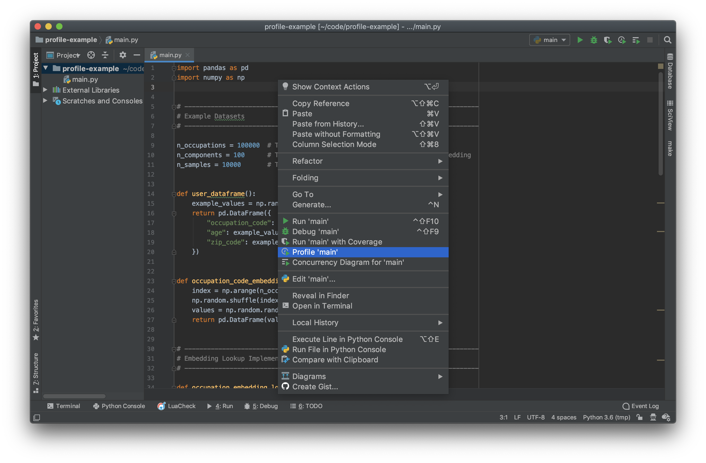
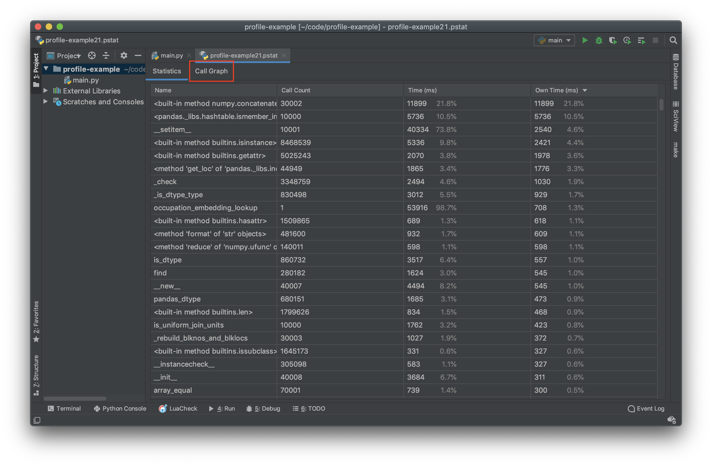
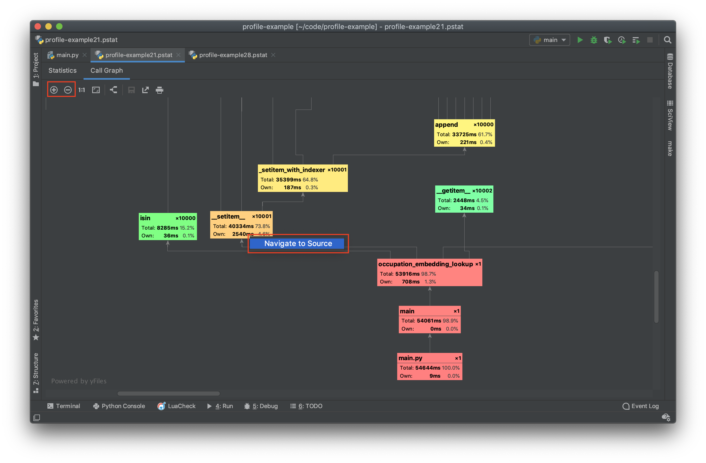
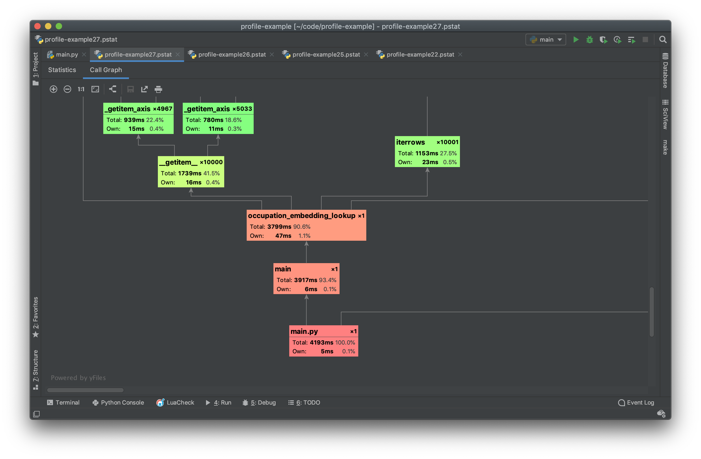

!!! Summary

    :white_check_mark: Use the standard python [cProfile] profiler

    :white_check_mark: Use PyCharm (Professional Edition) `.pstat` profile viewer
    
    :white_check_mark: Ensure entire program can be easily tested for performance


# Profiling Tools & Strategy

Profiling code is a hugely important part of data science code since machine
learning and AI algorithms are typically compute heavy processes. Performance
tuning is relevant during both training and prediction time.

During training time, performant code allows developers to have shorter 
development/training cycles. The difference between a function call that takes
10 seconds vs 1 second has a huge impact on the development experience. An 
example that many people have likely run into is when loading huge word vector 
models into memory. A load of GoogleNews W2V using Gensim can take multiple 
minutes before even being able to do a computation.

During prediction time, performance typically dictates how much a model will
cost to host. Performance is often ignored in favor of scaling out horizontally
and just paying the cost of hosting. Besides saving on hosting costs, the 
biggest motivating factor for performance tuning code would be the ability to
have a better/faster development experience (just like during training).

# Tools

There are a variety of profiling tools for python which fall under two 
different categories:

- **Scope-Based Profilers**: These profilers generally use the built-in 
    [sys.setprofile] or [sys.settrace] python library calls to track the 
    duration of each stack frame. Every time a function enters a scope, a start
    time is recorded, and every time the function exits, the end time is 
    recorded. This allows the profiler to record a hierarchical view of where 
    time is spent. These types of profilers may also introduce a lot of 
    overhead since every single scope entrance/exit is tracked. For programs
    which have many function calls (such as mapping a function over a giant 
    collection) the overhead of a scope-based profiler may give inflated
    measurements. Another limitation is that many python functions do not 
    generate a stack frame (for example built-in functions). This means that
    scope-based trackers may not give a granular enough idea of where
    time is being spent. Scope-based profilers cannot give line-level profiling
    information.
    
- **Sampling Profilers**: These profilers generally use the built-in 
    [sys._getframe] python library call to get the current state of the 
    application. In contrast to a scoped-based profiler, sampling profilers only
    periodically query the running python application to determine where time is
    being spent. Rather than tracking the duration of a function scope, a 
    sampling profiler tracks the number of times it sees a specific stack frame.
    This means that a sampling profiler will not track a very accurate measure
    of the overall method time. A huge benefit of a sampling profiler is that
    it has the ability to give line-level profile information. It also has 
    almost none of the overhead issues that a scope-based profiler has. Some
    sampling profilers are even designed to be run on long-running applications 
    for production monitoring.

The most widely used tools are the following:

- [cProfile] (Scope-Based): The python standard library profiler.
- [pprofile] (Scope-Based & Sampling): A pure python profiler with optional 
    sampling.
- [yappi] (Scope-Based & Sampling): A profiler (written in C) with multi-threading support.
- [scalene] (Sampling): A profiler (written in C++) with built-in memory usage profiling.

In general, it is recommended to start with [cProfile] and move on to other 
tools only if there is a need. Almost all use-cases are well-suited to the most 
basic scoped-based profiler and there are only infrequent times when more 
specialized profilers should be used. For example [yappi] may be well suited to 
testing a multi-threaded web server with extremely high traffic. Though 
sampling profilers can give extremely granular information, it is unlikely 
that the issues will not show up clearly in a scope-based profile.

# Strategy

!!! warning
    
    To follow along with the tutorial you must have [PyCharm] **Professional 
    Edition**. This tutorial makes extensive use of the `.pstat` profile viewer
    which is not available in the Community Edition

In order to describe the process of profiling code, the following section will 
use cProfile and PyCharm to go through the steps of optimizing an unoptimized
function. The example function will compute a categorical embedding. The 
function implements mapping an occupation code to an embedding vector. In the 
example the occupation code will be a number within the range 
`(0, n_occupations)` and the embedding will have the shape 
`(n_occupations, n_components)`.

```python
import pandas as pd
import numpy as np


# ------------------------------------------------------------------------------
# Example Datasets
# ------------------------------------------------------------------------------

n_occupations = 100000  # The number of possible occupation codes
n_components = 100      # The number of components in the occupation embedding
n_samples = 10000       # The number of users


def user_dataframe():
    example_values = np.random.randint(0, n_occupations * 2, n_samples)
    return pd.DataFrame({
        "occupation_code": example_values,
        "age": example_values,
        "zip_code": example_values,
    })


def occupation_code_embedding():
    index = np.arange(n_occupations)
    np.random.shuffle(index)
    values = np.random.random((n_occupations, n_components))
    return pd.DataFrame(values, index=index)


# ------------------------------------------------------------------------------
# Example Function Implementation
# ------------------------------------------------------------------------------

def occupation_embedding_lookup(user_df, embedding_df):
    result = pd.DataFrame(columns=embedding_df.columns)
    for index, row in user_df.iterrows():
        value = row["occupation_code"]

        # Check if the current occupation code is in the embedding index
        if embedding_df.index.isin([value]).any():
            # Fetch the embedding for the given occupation code
            vector = embedding_df.loc[value]
        else:
            # Select 0th (default) vector if occupation code is not found
            vector = embedding_df.iloc[0]
        result.loc[index] = vector

    # Concatenate all occupation embeddings for all users
    return result


# ------------------------------------------------------------------------------
# Main
# ------------------------------------------------------------------------------

def main():
    # Build an example user data and embedding
    user_df = user_dataframe()
    embedding_df = occupation_code_embedding()

    # Compute the embedding from the user feature
    result = occupation_embedding_lookup(user_df, embedding_df)


if __name__ == '__main__':
    main()
```

In the above example, the `occupation_embedding_lookup` will be the focus of
the profile. The `user_dataframe` and `occupation_code_embedding` functions
will show up in future profiles but should be ignored since they are only used 
to generate example datasets.

!!! question

    To demonstrate the importance of profiling, briefly look at the 
    `occupation_embedding_lookup` function and come up with an guess for which
    lines will have the worst performance problems.
    
    What do you think will be the most time-consuming part of the function? 
    
    How long do you think it will take the function to run?

In pycharm, open the project, and file and then right click the within the 
editor panel. From the dropdown menu, select the `Profile '<your_file>'` option.
This will invoke [cProfile] on the file.



When the profile is complete, the PyCharm `.pstat` viewer will open the 
resulting profile. The results of any profiler that is capable of generating a 
`.pstat` file can be viewed in PyCharm (even if the profile was not generated
within PyCharm).



On this `.pstat` viewer panel, the `Statistics` tab is selected by default.
Each row corresponds to a stack frame and its corresponding run time. This 
view can be useful, but it is hard to see exactly where bottleneck originated
from. Notice that the most time consuming call is `numpy.concatenate` which is 
never directly called in the code example above. This usually indicates that
this call is embedded in a library call.

The get a more informative view of the problem areas in the call-stack, select 
the `Call Graph` tab (outlined in red above).



This view presents a much more direct representation of what takes the most 
time. When the call graph is first presented, it may be too small to read the
individual nodes. The zoom can be used by pressing the buttons on the top left 
of the panel (highlighted in red above).

Each node in the PyCharm `.pstat` viewer represents a different stack frame.
PyCharm color codes these stack frames from most time-consuming (red) to least
time-consuming (green). 

Each stack frame tracks 3 things:

- Total time spent within the frame and all sub-frames (`Total`)
- Total time spent within the frame but not within a sub-frame (`Own`)
- Total number of times the frame was entered (`x<number>` in the top right)

This is the information that should be used to guide where to optimize the 
code. The first areas of focus should be the red boxes. The bottom 3 stack 
frames are composed of:

- `main.py` - The overall execution of the file. The `Total` will always equal
    the execution time of the program. In the example profile, the program took
    65.8 seconds to execute.
- `main` - This is the `def main()` function defined to drive the program.
- `occupation_embedding_lookup` - This is the function that performs the 
    embedding. In this view it becomes clear that the embedding computation 
    takes up nearly all of the execution time (99%). The remaining execution 
    time is spent in the initialization of data.
    
None of this is very helpful since it is known that very little computation is
occuring outside of the embedding function. The next most time consuming 
portion of the code is the `__setitem__` call. Just from looking at the name, it
is not clear where this is occuring. PyCharm can directly show the source code
of the problem by right clicking on the node and selecting the "Navigate To
Source" option (highlighted in red above).

Upon inspecting the source code it becomes clear that this call is the 
`DataFrame.__setitem__` method. Further inspection of the profile call graph
chart reveals that this method calls into `DataFrame.append` which then calls
into `numpy.concatenate` (The most time consuming individual function).

There is only one place in the code where a DataFrame set item occurs in 
the `occupation_embedding_lookup` function:

```python hl_lines="9"
def occupation_embedding_lookup(user_df, embedding_df):
    result = pd.DataFrame(columns=embedding_df.columns)
    for index, row in user_df.iterrows():
        value = row["occupation_code"]
        if embedding_df.index.isin([value]).any():
            vector = embedding_df.loc[value]
        else:
            vector = embedding_df.iloc[0]
        result.loc[index] = vector
    return result
```

From the profile it becomes clear that every call to 
`result.loc[index] = vector` causes an array concatenation to be performed. This
means that a completely new array is allocated *every time* this line is 
executed. 

To alleviate the issue, modify the function to collect the results in
a structure designed for concatenation. A python list is a good candidate for 
this since it is tuned to handle appending.

```python hl_lines="2 9 10"
def occupation_embedding_lookup(user_df, embedding_df):
    result = list()
    for index, row in user_df.iterrows():
        value = row["occupation_code"]
        if embedding_df.index.isin([value]).any():
            vector = embedding_df.loc[value]
        else:
            vector = embedding_df.iloc[0]
        result.append(vector)
    return pd.DataFrame(result, index=user_df.index, columns=embedding_df.columns)
```

Run the profile on the updated function to view the results.


The first thing to note is that the overall runtime has been drastically 
reduced. The original profile of 65.8 seconds has been reduced to 11.4 seconds.

The new profile now shows that the next most time consuming part of the 
function is the check to see if the value is in the index.

```python hl_lines="5"
def occupation_embedding_lookup(user_df, embedding_df):
    result = list()
    for index, row in user_df.iterrows():
        value = row["occupation_code"]
        if embedding_df.index.isin([value]).any():
            vector = embedding_df.loc[value]
        else:
            vector = embedding_df.iloc[0]
        result.append(vector)
    return pd.DataFrame(result, index=user_df.index, columns=embedding_df.columns)
```

The line `embedding_df.index.isin([value]).any()` ends up checking to see if
each of the index values match the current occupation code. Rather than an 
`O(1)` hash lookup, this performs an `0(n)` search on the embedding index for 
every  single row in the `user_df`. This can be alleviated by simplifying the 
logic and using the `in` operator on the `pd.Index` object.

```python hl_lines="5"
def occupation_embedding_lookup(user_df, embedding_df):
    result = list()
    for index, row in user_df.iterrows():
        value = row["occupation_code"]
        if value in embedding_df.index:
            vector = embedding_df.loc[value]
        else:
            vector = embedding_df.iloc[0]
        result.append(vector)
    return pd.DataFrame(result, index=user_df.index, columns=embedding_df.columns)
```

Run the profile on the updated function to view the results.



The final profile now shows that the overall execution time is 4.1 seconds. This
is a 16x speedup from the original profile!

Even though there may still be performance issues with this function, the code 
is already much more optimized than it was with just a few minor tweaks. 

!!! hint "Challenge"

    Continue to profile the code and see if you can get a 1000x speedup!


[PyCharm]: https://www.jetbrains.com/pycharm/

[sys.setprofile]: https://docs.python.org/3/library/sys.html#sys.setprofile
[sys.settrace]: https://docs.python.org/3/library/sys.html#sys.settrace
[sys._getframe]: https://docs.python.org/3/library/sys.html#sys._getframe

[cProfile]: https://docs.python.org/3/library/profile.html#profile
[yappi]: https://github.com/sumerc/yappi
[scalene]: https://github.com/emeryberger/scalene
[pprofile]: https://github.com/vpelletier/pprofile
